# SCU_DB BY LanTingFeng

<span></span>
<span><span>
<span><span>
<span><span>
<details>
<summary>Homework1 details</summary>
<h2>Homework1</h2>

```sql
--Q1 Get all unique ShipNames from the Order table that contain a hyphen '-'.
--Details: In addition, get all the characters preceding the (first) hyphen. Return ship 
--names alphabetically. Your first row should look like Bottom-Dollar Markets|Bottom
SELECT
 DISTINCT ShipName,
 SUBSTRING(ShipName, 0, INSTR(shipname, "-"))
FROM
 "Order" o
WHERE
 ShipName LIKE "%-%"
ORDER BY
 ShipName ;
```

Result:
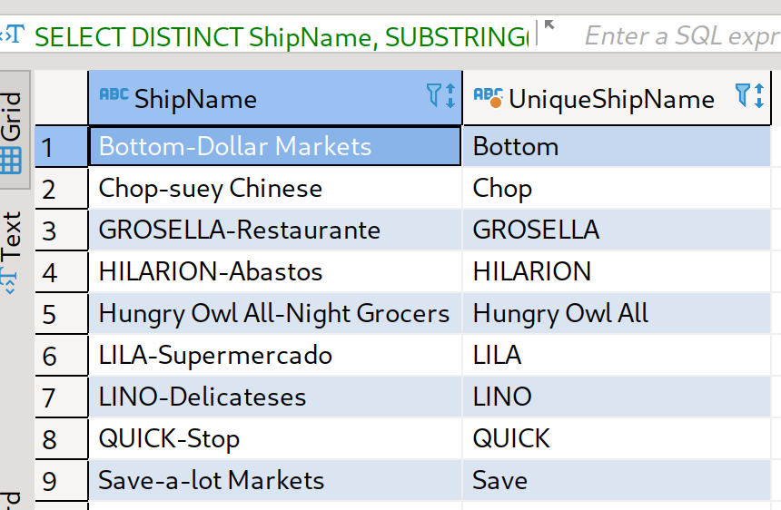

```sql
--Q2 Indicate if an order's ShipCountry is in North America. For our purposes, this 
--is 'USA', 'Mexico', 'Canada'
--Details: You should print the Order Id, ShipCountry, and another column that is 
--either 'NorthAmerica' or 'OtherPlace' depending on the Ship Country.
--Order by the primary key (Id) ascending and return 20 rows starting from Order 
--Id 15445 Your output should look 
--like 15445|France|OtherPlace or 15454|Canada|NorthAmerica

SELECT
 *
FROM
 (
 SELECT
  DISTINCT Id ,
  ShipCountry,
  "NorthAmerica" AS "InNorthAmerica"
 FROM
  "Order" o
 WHERE
  ShipCountry IN ("USA", "Mexico", "Canada")
  AND 
  Id >= 15445
UNION
 SELECT
  DISTINCT Id ,
  ShipCountry,
  "OtherPlace" AS "InNorthAmerica"
 FROM
  "Order" o
 WHERE
  ShipCountry NOT IN ("USA", "Mexico", "Canada")
  AND 
  Id >= 15445)
ORDER BY
 Id ASC
LIMIT 20;
```

Result:
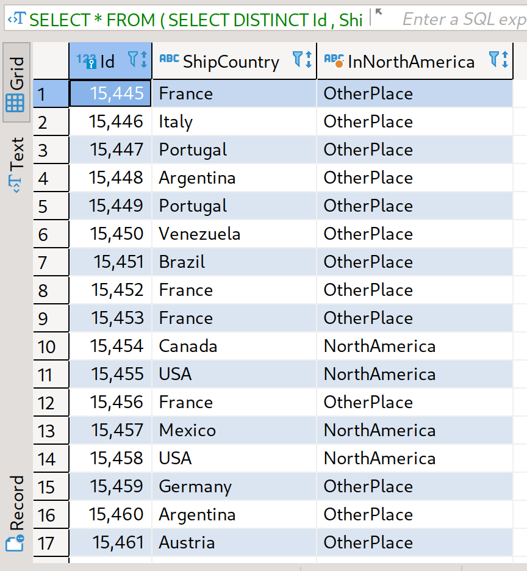

```sql
--Q3 For each Shipper, find the percentage of orders which are late.
--Details: An order is considered late if ShippedDate > RequiredDate. Print the 
--following format, order by descending precentage, rounded to the nearest 
--hundredths, like United Package|23.44
SELECT
 t1.CompanyName,ROUND((late + 0.0) / (total + 0.0),4) * 100 AS "DelayPercent"
FROM
 (
 SELECT
  COUNT(*) late,
  CompanyName
 FROM
  "Order" o
 JOIN Shipper s ON
  o.ShipVia = s.Id
 WHERE
  o.ShippedDate > o.RequiredDate
 GROUP BY
  s.Id) t1,
 (
 SELECT
  COUNT(*) total,
  CompanyName
 FROM
  "Order" o
 JOIN Shipper s ON
  o.ShipVia = s.Id
 GROUP BY
  s.Id) t2
 WHERE t1.CompanyName = t2.CompanyName
 ORDER BY DelayPercent DESC;
```

Result:
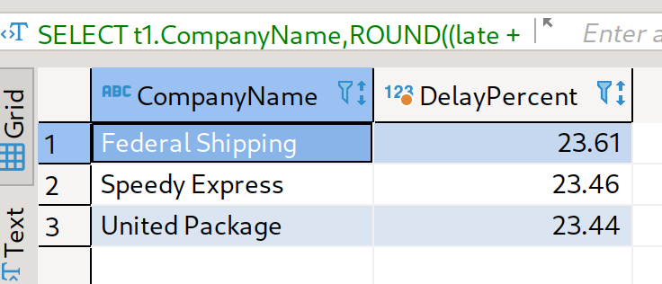

```sql
--Q4 Compute some statistics about categories of products
--Details: Get the number of products, average unit price (rounded to 2 decimal 
--places), minimum unit price, maximum unit price, and total units on order for 
--categories containing greater than 10 products.
--Order by Category Id. Your output should look like Beverages|12|37.98|4.5|263.5|60
SELECT
 CategoryName,
 COUNT(*) ProductNumber,
 ROUND(AVG(UnitPrice),2) AvgUnitPrice,
 MIN(UnitPrice) MinUnitPrice,
 MAX(UnitPrice) MaxUnitPrice,
 SUM(UnitsOnOrder) UnitsOnOrderSum
FROM
 Category c
JOIN Product p ON
 c.Id = p.CategoryId
GROUP BY
 p.CategoryId
HAVING ProductNumber > 10
ORDER BY CategoryId;
```

Result:
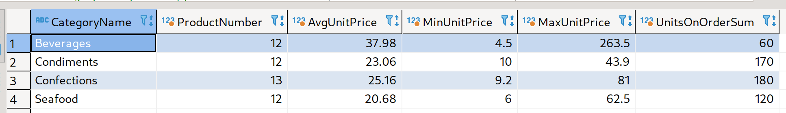

```sql
--Q5 [10 POINTS] (Q5_DISCONTINUED):
--For each of the 8 discontinued products in the database, which customer made the 
--first ever order for the product? Output the 
--customer's CompanyName and ContactName
--Details: Print the following format, order by ProductName alphabetically: Alice
--Mutton|Consolidated Holdings|Elizabeth Brown
SELECT
 ProductName,
 CompanyName,
 ContactName
FROM
 (
 SELECT
  CustomerId,
  ProductId,
  ProductName,
  MIN(OrderDate)
 FROM
  OrderDetail od
 JOIN Product p ON
  p.Id = od.ProductId
 JOIN "Order" o ON
  o.Id = od.OrderId
 WHERE
  p.Discontinued = 1
 GROUP BY
  ProductId ) t1
JOIN Customer c 
ON
 t1.CustomerId = c.Id 
ORDER BY ProductName;
```

Result:
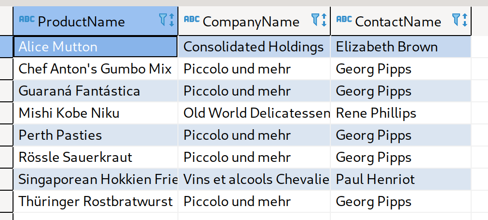

```sql
--Q6 [10 POINTS] (Q6_ORDER_LAGS):
--For the first 10 orders by CutomerId BLONP: get the Order's Id, OrderDate, 
--previous OrderDate, and difference between the previous and current. Return 
--results ordered by OrderDate (ascending)
--Details: The "previous" OrderDate for the first order should default to itself (lag 
--time = 0). Use the julianday() function for date arithmetic (example).
--Use lag(expr, offset, default) for grabbing previous dates.
--Please round the lag time to the nearest hundredth, formatted like 17361|2012-09-
--19 12:13:21|2012-09-18 22:37:15|0.57\
SELECT Id,OrderDate,PreDate,ROUND(JULIANDAY(OrderDate) - JULIANDAY(PreDate),2) DiffOrderDate
FROM
(SELECT
 o.Id Id,
 OrderDate,
 LAG(OrderDate,1,OrderDate)
 OVER (
  ORDER BY
  OrderDate) PreDate
FROM
 "Order" o
JOIN Customer c ON
 o.CustomerId = c.id
WHERE
 CustomerId = "BLONP"
ORDER BY
 OrderDate ASC
LIMIT 10);
```

Result:
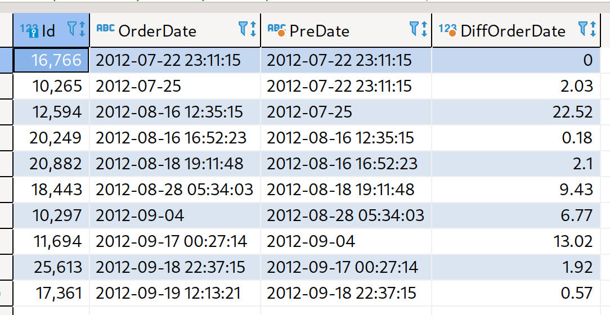

```sql
--Q7 [15 POINTS] (Q7_TOTAL_COST_QUARTILES):
--For each Customer, get the CompanyName, CustomerId, and "total expenditures". 
--Output the bottom quartile of Customers, as measured by total expenditures.
--Details: Calculate expenditure using UnitPrice and Quantity (ignore Discount). 
--Compute the quartiles for each company's total expenditures using NTILE. The 
--bottom quartile is the 1st quartile, order them by increasing expenditure.
--Make sure your output is formatted as follows (round expenditure to nearest 
--hundredths): Bon app|BONAP|4485708.49
--Note: There are orders for CustomerIds that don't appear in the Customer table. 
--You should still consider these "Customers" and output them. If 
--the CompanyName is missing, override the NULL to 'MISSING_NAME' using IFNULL.

WITH total_cost AS (
 SELECT 
  IFNULL(CompanyName, "MISSING_NAME") AS "CompanyName",
  CustomerId, 
  ROUND(SUM(UnitPrice * Quantity), 2) AS "TotalExpenditures"
 FROM 'Order' o
 INNER JOIN OrderDetail od ON o.Id = od.OrderId
 LEFT JOIN Customer AS c ON o.CustomerId = c.Id
 GROUP BY o.CustomerId
),
divide_bucket AS (
 SELECT *, NTILE(4) OVER(ORDER BY TotalExpenditures ASC) AS bucket_number
 FROM total_cost
)
SELECT CompanyName, CustomerId, TotalExpenditures
FROM divide_bucket
WHERE bucket_number = 1;
```

Result:
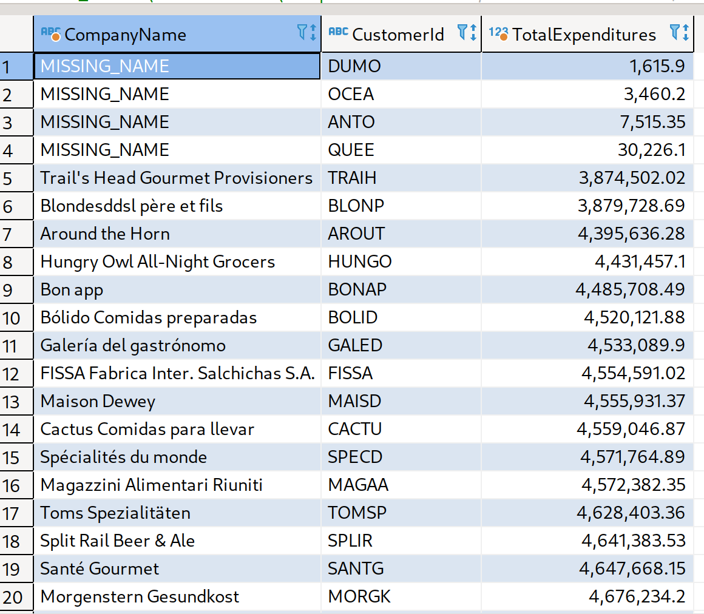

```sql
--Q8 [15 POINTS] (Q8_YOUNGBLOOD):
--Find the youngest employee serving each Region. If a Region is not served by an 
--employee, ignore it.
--Details: Print the Region Description, First Name, Last Name, and Birth Date. 
--Order by Region Id.
--Your first row should look like Eastern|Steven|Buchanan|1987-03-04
WITH employee_info AS
(
SELECT
 FirstName ,
 LastName ,
 MIN(BirthDate) MinBirthDate,
 Id eId
FROM
 Employee e
GROUP BY
 Region
ORDER BY
 Region ),
territory_info AS 
(
 SELECT * FROM EmployeeTerritory et  JOIN Territory t ON et.TerritoryId  = t.Id JOIN Employee e ON e.Id = et.EmployeeId 
)
SELECT
 DISTINCT RegionDescription,ei.FirstName ,ei.LastName,MinBirthDate
FROM
 territory_info ti
JOIN employee_info ei ON
 ei.eId = ti.EmployeeId
JOIN Region r ON ti.RegionId = r.Id ;
```

Result:
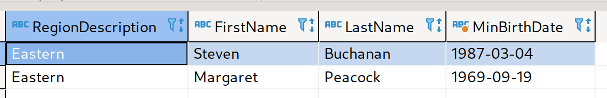

```sql
--Q9 [15 POINTS] (Q9_CHRISTMAS):
--Concatenate the ProductNames ordered by the Company 'Queen
--Cozinha' on 2014-12-25.
--Details: Order the products by Id (ascending). Print a single string
--containing all the dup names separated by commas like Mishi Kobe
--Niku, NuNuCa Nuß-Nougat-Creme...
--Hint: You might find Recursive CTEs useful.
WITH OrderFullTable AS (
SELECT
 *
FROM
 OrderDetail od
JOIN "Order" o ON
 od.OrderId = o.Id
JOIN Product p ON
 od.ProductId = p.Id),
QueenOrder AS (
SELECT
 *
FROM
 OrderFulltable oft
JOIN Customer c ON
 oft.CustomerId = c.Id
WHERE
 c.CompanyName = "Queen Cozinha"
 AND oft.OrderDate LIKE "2014-12-25%"),
OrderedProductName AS
(
SELECT
 ProductName
FROM
 QueenOrder
ORDER BY
 ProductId ASC
)
SELECT
 GROUP_CONCAT(ProductName) ProductNameCatString
FROM
 OrderedProductName;
```

Result:
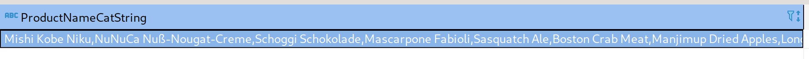
</details>

<details>
<summary>Homework2 details</summary>

## Homework2

### extendible_hash_test passed

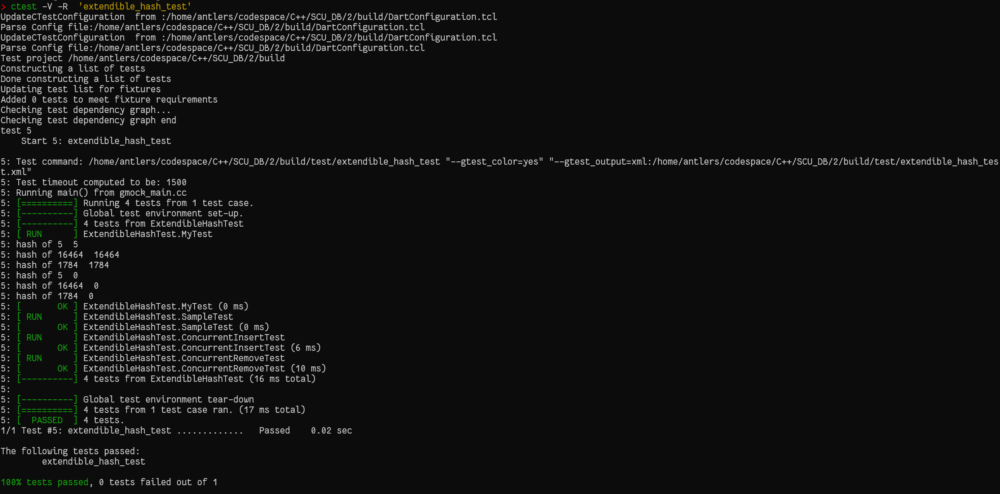

### lru_replacer_test passed

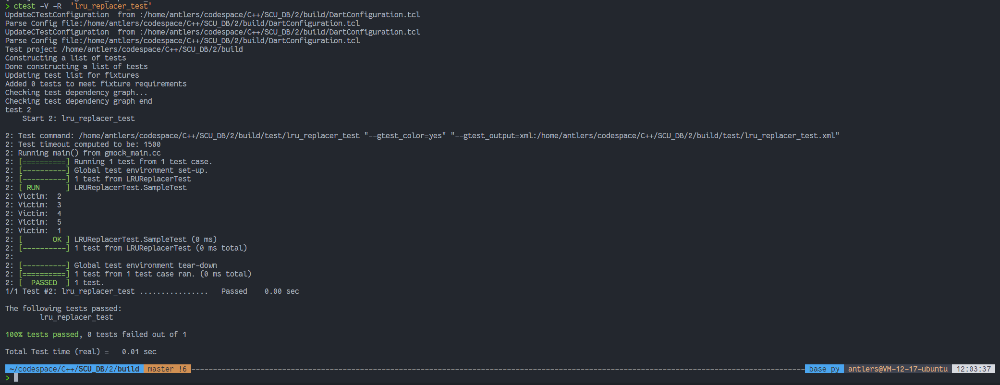

### buffer_pool_manager_test passed

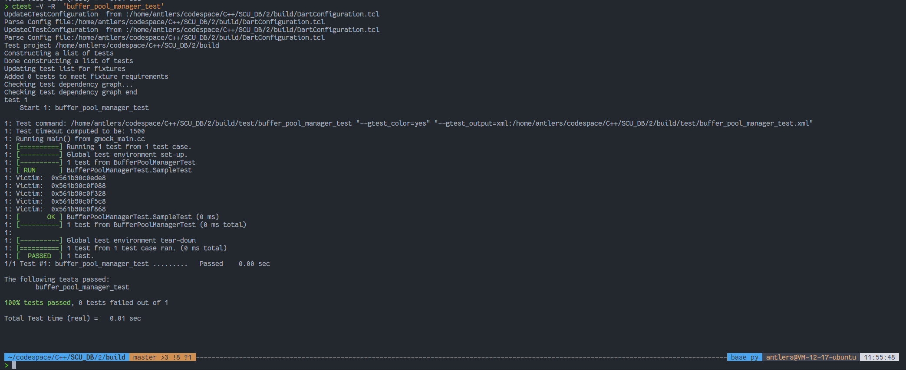
</details>

<details>
<summary>Homework3 details</summary>

## Homework3 - based on homework2

### b_plus_tree_print_test_running

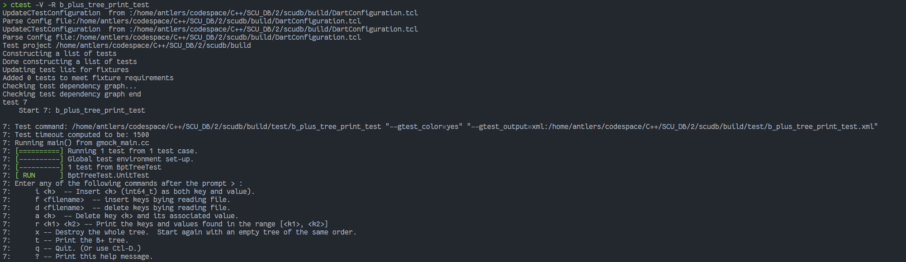

### b_plus_tree_print_test_insert&delete

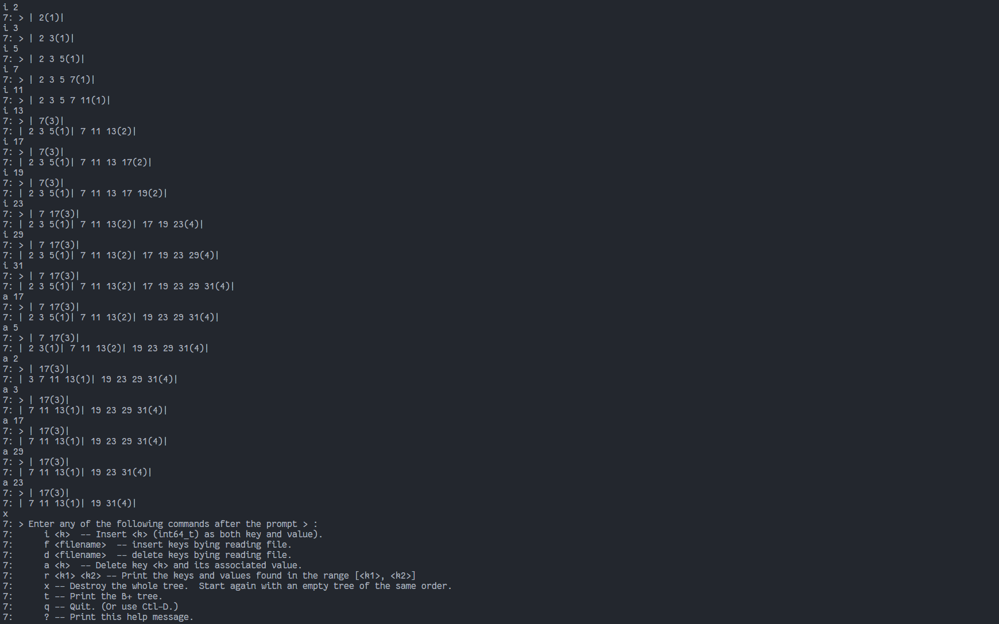

### b_plus_tree_print_test_passed

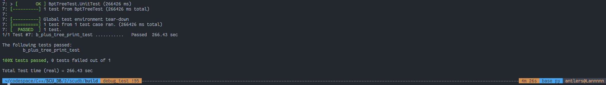

### b_plus_tree_test_passed

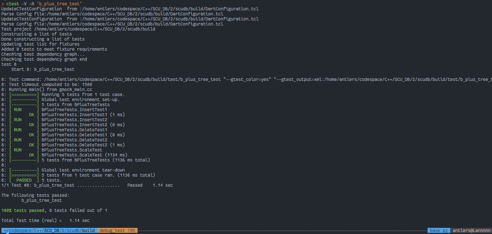

</details>
